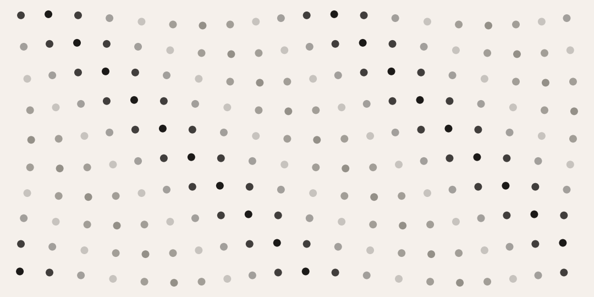
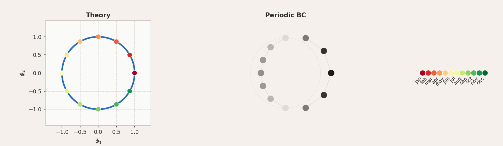
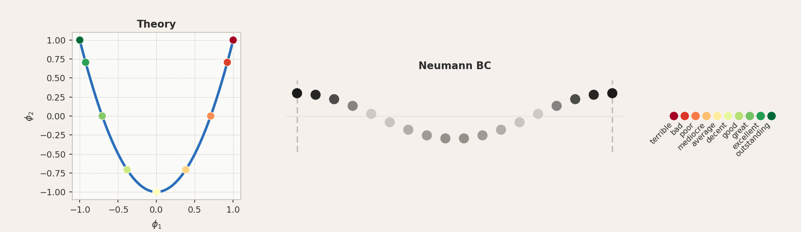
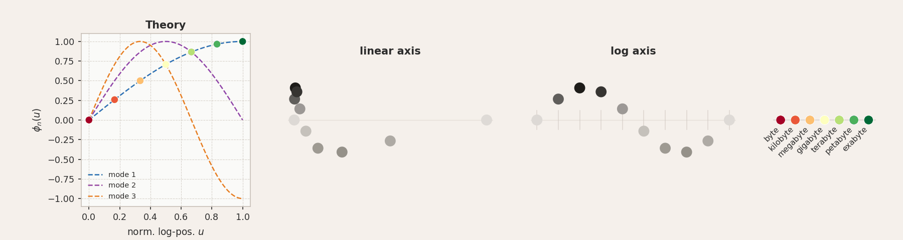
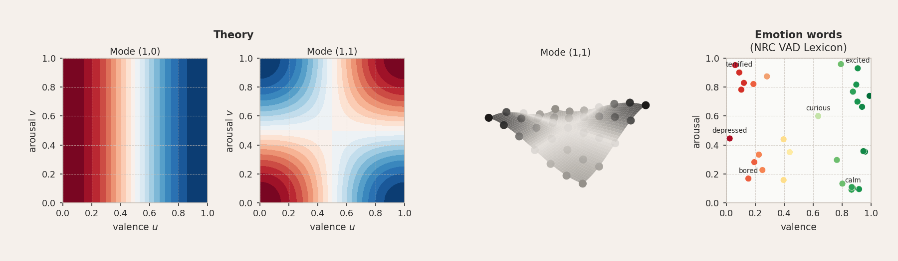

# Semantic Phonons



Applying the mathematics of phonon modes to study semantic representations in language models. Theoretical predictions for different boundary condition types are derived and verified in GloVe 300d, Gemma 2B, and Gemma 2 27B. This extends [Karkada et al.](https://arxiv.org/abs/2602.15029), who showed that LLMs represent the months of the year in a cyclic structure following from periodic boundary conditions on the co-occurrence matrix.

You can find the write-up [here](https://lukasbongartz.github.io/projects/semantic-phonons.html).

---

## Boundary condition types

**Periodic BC**



Cyclic concepts (months, days of the week, compass directions, ...) live on a ring. The eigenmodes are complex exponentials $\phi_n(x) = e^{2\pi i n x / L}$, whose real and imaginary parts trace a circle in the top-PC plane.

**Neumann BC — ordinal scales**



Open-ended ordinal scales (quality, temperature, emotion valence, ...) map onto a chain with free ends where $\phi^\prime(0) = \phi^\prime(L) = 0$. The eigenmodes are cosines $\phi_n(x) = \cos(n\pi x / L)$, and the first two satisfy the Chebyshev relation $\phi_2 = 2\phi_1^2 - 1$, tracing a parabola.

**Mixed BC — logarithmic scales**



Concepts whose meaning is carried by ratios (storage sizes, time durations, monetary values, ...) have a definite lower anchor and an open upper end, calling for Dirichlet at $x = 0$ and Neumann at $x = L$. The modes are $\phi_n(u) = \sin(n\pi u / 2)$, producing a quarter-sine arc when plotted against the normalised log-position $u$.

**2D Neumann BC**



Emotion words placed on [Russell's valence-arousal plane](https://pdodds.w3.uvm.edu/research/papers/others/1980/russell1980a.pdf), with coordinates from the [NRC VAD Lexicon](https://saifmohammad.com/WebPages/nrc-vad.html) (Mohammad, 2018), follow 2D Neumann eigenmodes $\phi_{m,n}(u,v) = \cos(m\pi u)\cos(n\pi v)$.

---

## Setup

```bash
pip install -r requirements.txt
```

GloVe is downloaded automatically on first run via gensim. Pre-computed results are in `results/`.

---

## Running the experiments

```bash
# Run all experiments (requires GPU)
bash run_all.sh

# Or individually:
python experiments/periodic.py --llm
python experiments/neumann.py --llm
python experiments/log_scale.py --llm
python experiments/neumann_2d.py --llm --model google/gemma-2-27b --batch-size 4
```

All 1-D experiment scripts accept `--model` and `--device` flags. The 2D Neumann experiment defaults to Gemma 2 27B.

---

## License

MIT
